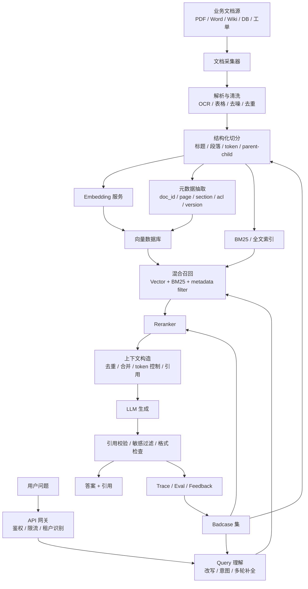
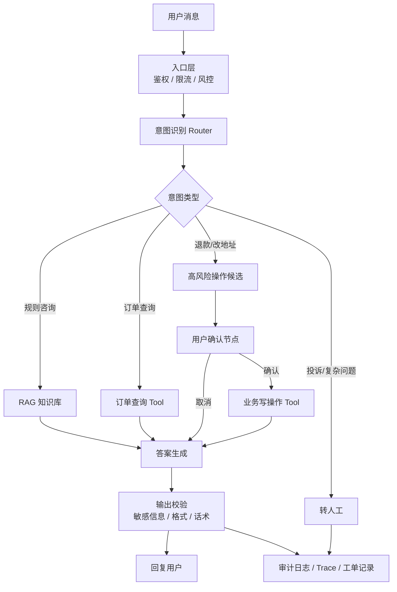
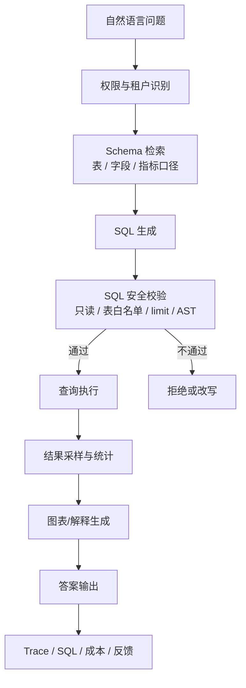
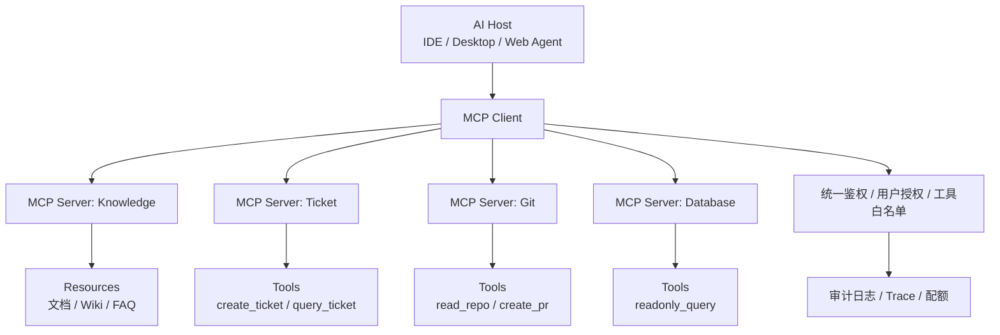
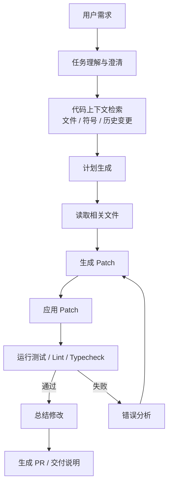

# 系统设计图与伪代码

> 用法：面试遇到系统设计题时，先画图，再讲链路，最后讲权衡。这里的 Mermaid 图可以直接复制到支持 Markdown 的编辑器里渲染。

## 1. 企业知识库 RAG 架构

### 架构图



### 面试讲法

先讲离线索引链路，再讲在线问答链路，然后补权限、评测和线上治理。

关键点：

- 文档解析质量决定上限。
- chunk 策略影响召回和生成。
- metadata 是权限、引用和更新的基础。
- hybrid search + rerank 比单纯向量检索更稳。
- RAG 要分层评估，不能只看最终答案。

### 伪代码

```python
def ingest_document(file, tenant_id):
    raw = parse_file(file)
    cleaned = clean_text(raw)
    chunks = split_by_structure(cleaned)

    records = []
    for chunk in chunks:
        vector = embedding_model.embed(chunk.text)
        records.append({
            "doc_id": file.id,
            "chunk_id": chunk.id,
            "text": chunk.text,
            "vector": vector,
            "metadata": {
                "tenant_id": tenant_id,
                "page": chunk.page,
                "section": chunk.section,
                "acl": file.acl,
                "version": file.version,
            },
        })

    vector_store.upsert(records)
    keyword_index.upsert(records)


def answer_question(user, question, session):
    auth_filter = build_acl_filter(user)
    rewritten_query = rewrite_query(question, session.history)

    vector_hits = vector_store.search(
        query=rewritten_query,
        top_k=50,
        filter=auth_filter,
    )
    keyword_hits = keyword_index.search(
        query=rewritten_query,
        top_k=50,
        filter=auth_filter,
    )

    candidates = merge_and_deduplicate(vector_hits, keyword_hits)
    ranked = reranker.rank(rewritten_query, candidates)
    context = build_context(ranked[:8])

    answer = llm.generate(
        prompt=rag_prompt(question=question, context=context)
    )

    checked = validate_citations(answer, context)
    trace_log(user=user, query=question, docs=ranked, answer=checked)
    return checked
```

### 高频追问

- 权限过滤必须进入检索链路，不能只在生成后过滤。
- 引用要回溯到 doc_id、page、section。
- 增量更新要按 doc_id/version 删除旧 chunk，再写新 chunk。
- badcase 要沉淀成评测集。

## 2. 客服 Agent 架构

### 架构图



### 面试讲法

客服 Agent 的核心不是让模型随便操作业务系统，而是把查询、检索、生成和写操作分层控制。

关键点：

- 先做意图路由。
- 查询类工具可以自动执行。
- 写操作必须用户确认。
- 工具执行要鉴权。
- 复杂或失败场景转人工。
- 全链路审计。

### LangGraph 风格伪代码

```python
class CustomerAgentState(TypedDict):
    user_id: str
    message: str
    intent: str | None
    retrieved_docs: list
    tool_result: dict | None
    pending_action: dict | None
    approved: bool
    final_answer: str | None
    step_count: int


def route_intent(state):
    state["intent"] = intent_model.classify(state["message"])
    return state


def decide_next(state):
    if state["intent"] == "policy_question":
        return "retrieve_policy"
    if state["intent"] == "order_query":
        return "query_order"
    if state["intent"] in {"refund", "change_address"}:
        return "request_confirmation"
    return "handoff"


def request_confirmation(state):
    state["pending_action"] = build_action_from_message(state["message"])
    interrupt_for_user_confirmation(state["pending_action"])
    return state


def execute_write_tool(state):
    assert state["approved"] is True
    assert has_permission(state["user_id"], state["pending_action"])
    state["tool_result"] = business_tool.call(
        action=state["pending_action"],
        idempotency_key=make_idempotency_key(state),
    )
    return state
```

### 高频追问

- 非幂等操作必须加 idempotency_key。
- 订单查询前要确认用户是否拥有订单。
- 退款、改地址、取消订单要二次确认。
- 工具失败要有业务错误解释，不能直接把异常栈给用户。

## 3. 数据分析 Agent 架构

### 架构图



### 面试讲法

数据分析 Agent 的最大风险不是生成 SQL，而是错误 SQL、越权查询和高成本查询。

关键点：

- 只读账号。
- schema 和指标口径要检索。
- SQL 必须 AST 校验。
- 限制表、列、行数和执行时间。
- 敏感字段脱敏。
- 高成本查询二次确认。

### 伪代码

```python
def answer_data_question(user, question):
    allowed_tables = permission_service.allowed_tables(user)
    schema_context = schema_retriever.retrieve(question, allowed_tables)

    sql = llm.generate(
        prompt=sql_prompt(question=question, schema=schema_context)
    )

    parsed = parse_sql(sql)
    validate_readonly(parsed)
    validate_table_whitelist(parsed, allowed_tables)
    add_limit_if_missing(parsed, max_rows=1000)
    estimate_query_cost(parsed)

    result = query_engine.execute(parsed.to_sql(), timeout=10)
    safe_result = mask_sensitive_columns(result, user)

    return llm.generate(
        prompt=explain_result_prompt(question, safe_result)
    )
```

### 高频追问

- 不允许模型直接执行未校验 SQL。
- 不把全库 schema 全塞给模型，要按问题检索相关 schema。
- 指标口径要有统一定义，不能让模型自由解释。
- 对大查询做 cost estimate 和二次确认。

## 4. MCP 工具平台架构

### 架构图



### 面试讲法

MCP 平台的价值是把不同外部能力以统一协议暴露给 AI 应用。但 MCP 只解决连接标准化，不自动解决企业安全问题。

关键点：

- MCP server 暴露 tools/resources/prompts。
- 内部 API 可通过 OpenAPI/RPC 包装成 MCP tools。
- Host/Client 侧控制用户授权和工具白名单。
- Server 侧仍要做业务鉴权。
- 高风险工具要确认和审计。

### MCP Tool 包装伪代码

```python
@mcp.tool(
    name="query_ticket",
    description="根据工单 ID 查询工单状态。仅用于查询，不会修改工单。"
)
def query_ticket(ticket_id: str, user_context: UserContext):
    if not permission.can_read_ticket(user_context.user_id, ticket_id):
        raise PermissionDenied("no permission to read this ticket")

    result = ticket_client.get_ticket(ticket_id)
    return redact_sensitive_fields(result)


@mcp.tool(
    name="create_ticket",
    description="创建新的客服工单。调用前必须获得用户确认。"
)
def create_ticket(title: str, content: str, user_context: UserContext):
    require_user_confirmation(user_context.session_id)
    return ticket_client.create(
        title=title,
        content=content,
        creator=user_context.user_id,
        idempotency_key=user_context.request_id,
    )
```

### 高频追问

- MCP 和 OpenAPI 不是替代关系。
- MCP server 内部可以调用 OpenAPI/gRPC/数据库。
- roots 可限制文件访问边界。
- tool 调用参数仍要校验，不能信任模型。

## 5. 代码 Agent 架构

### 架构图



### 面试讲法

代码 Agent 的关键是上下文选择、最小修改、测试验证和保护用户已有改动。

关键点：

- 先检索相关文件，不全仓库塞上下文。
- 修改前理解现有模式。
- patch 粒度小。
- 运行测试。
- 不覆盖用户未提交修改。
- 失败要基于错误日志迭代。

### 伪代码

```python
def code_agent_task(requirement):
    plan = planner.create_plan(requirement)
    files = code_retriever.find_relevant_files(requirement)

    for file in files:
        content = read_file(file)
        context.add(file, content)

    patch = llm.generate_patch(requirement, context, plan)
    apply_patch_safely(patch)

    result = run_tests(select_tests(files))
    if not result.ok:
        fix_patch = llm.fix_from_test_output(result.output, context)
        apply_patch_safely(fix_patch)
        result = run_tests(select_tests(files))

    return summarize_changes(result)
```

### 高频追问

- 不能直接让模型执行任意 shell。
- 文件读写工具要限制 workspace。
- 修改前后都要检查 diff。
- 测试失败时要读取错误日志，而不是盲改。

## 6. 系统设计回答模板

遇到任何 AI Agent/RAG 系统设计题，可以按这个顺序答：

```text
1. 明确业务目标和用户
2. 画整体架构
3. 讲离线数据链路
4. 讲在线请求链路
5. 讲状态、权限、安全
6. 讲评估指标
7. 讲延迟、成本、稳定性
8. 讲 badcase 闭环和迭代
```

万能收束句：

```text
这个系统的核心不是把大模型接进来，而是围绕大模型的不确定性做工程治理：
数据要可追溯，工具要可控，状态要可恢复，答案要可评估，风险操作要可审计。
```

