# 总目录导航图与学习地图

> 用法：当你不知道该看哪份文件时，先打开这份。  
> 目标：把全套材料按“准备、背诵、模拟、投递、复盘”串成一张路线图。

## 0. 先选任务，不要先选文件

| 你想完成的任务 | 路径 |
|---|---|
| 今天开始系统准备 | `README` -> `00` -> `01` -> `74` |
| 收到面试通知后定路线 | 先看 `48`，按剩余时间分流；2 小时走 `48` -> `80` -> `74` -> `78`，半天走 `48` -> `55` -> `80` -> `74` -> `78`，1 天再进入 `69/52/41/77/66` |
| 把简历项目讲顺 | `18` -> `50` -> `59` -> `76` -> `42` |
| 练一轮模拟面 | `80` -> `69` -> `52` -> `41` -> `77`；录音复盘时再用 `57` |
| 准备二面系统设计 | `14` -> `51` -> `67` -> `54` -> `60` |
| 临面最后启动 | 只看手头的 `80` 上场包和 `78` 的 `0-4` 节 |

判断路线是否有效，只看一个标准：你看完后能不能立刻产出一段可口述答案、一个题单、一张架构图或一份复盘。

## 1. 一张图看全套资料

```mermaid
flowchart TD
    A["开始准备"] --> B["00 阅读索引"]
    B --> C["48/80/74/78 临战主路径"]
    B -. "余力查漏" .-> C0["34 可选查漏清单"]
    B --> D["01 总览知识地图"]

    D --> E["基础专题"]
    E --> E1["02 Agent 基础"]
    E --> E2["03 LangChain/LangGraph"]
    E --> E3["04 RAG/向量数据库"]
    E --> E4["05 Prompt/Tool Calling"]
    E --> E5["06 模型微调"]
    E --> E6["07 Python 后端"]
    E --> E7["08 OpenAPI/RPC/MCP"]

    D --> F["开口回答"]
    F --> F1["12 标准回答三件套"]
    F --> F2["28 P0 1-70"]
    F --> F3["29 P0 71-100"]
    F --> F4["30 P1 RAG/Agent"]
    F --> F5["31 P1 Prompt/协议/微调"]

    D --> G["系统设计与项目"]
    G --> G1["14 架构图与伪代码"]
    G --> G2["18 自我介绍"]
    G --> G3["20 简历 Bullet"]
    G --> G4["24 项目答辩"]
    G --> G5["32 平台系统设计"]
    G --> G6["73 Data Agent/NL2SQL"]
    G --> G7["76 项目表达迁移"]

    D --> H["练习与模拟"]
    H --> H1["13 连续追问链"]
    H --> H2["16 模拟面试套卷"]
    H --> H3["17 代码实战"]
    H --> H4["23 手撕强化"]
    H --> H5["27 P0/P1/P2 题库"]
    H --> H6["33 P2 代码表达"]
    H --> H0["80 JD 实战工单"]
    H0 --> H7["69 JD 定制题单"]
    H --> H8["77 模拟面闭环看板"]

    D --> I["公司与场景"]
    I --> I1["15 公司权重"]
    I --> I2["22 公司专项回答"]
    I --> I3["25 英文面试"]
    I --> I4["75 公司专项模拟评分"]

    D --> J["证据与复盘"]
    J --> J1["21 面经证据库/错题本"]
    J --> J2["26 真实面经填充"]
    J --> J3["35 面试后复盘更新"]
    J --> J4["79 资料库维护看板"]

    C --> K["临面"]
    K --> K1["48 通知速查"]
    K1 --> K0["80 本次 JD 上场包"]
    K0 --> K2["74 减负路线"]
    K2 --> L2["78 临面当天作战面板"]
    K3["19 2小时查漏参考"] -.-> K0

    L2 --> M["面试"]
    M --> J3
```



## 2. 文件分组

> 说明：下面分组既是阅读地图，也是维护分层。Mermaid 图只展示主路径，完整文件归属以本节表格为准。

### 2.1 入口层

| 文件 | 作用 |
|---|---|
| `README.md` | 第一次打开项目时的 30 秒入口 |
| `00-阅读索引.md` | 全套资料的主索引 |
| `36-总目录导航图与学习地图.md` | 当前这份，用来理解资料关系 |
| `48-面试通知速查导航卡.md` | 收到通知后 5 分钟判断路线 |
| `55-公司轮次面试路径卡.md` | 按公司、轮次、剩余时间选择行动卡 |
| `74-减负版复习路线与抽题清单.md` | 资料太多时做取舍、抽题和停看 |
| `78-临面当天作战面板.md` | 面试当天最后 30 分钟/10 分钟/3 分钟入口 |
| `80-JD实战转化闭环工单.md` | 把一次具体 JD 转成题单、模拟、修复和上场包 |

### 2.1.1 投递与路线决策层

| 文件 | 作用 |
|---|---|
| `37-JD关键词匹配与投递策略.md` | 投递前分析 JD 和复习权重 |
| `38-真实JD案例填充版.md` | 对照真实/模拟 JD 做投递演练 |
| `39-个人复习计划生成器.md` | 按岗位和剩余时间生成复习计划 |
| `40-大厂公司轮次作战手册.md` | 按目标公司和轮次做临战准备 |
| `46-公司轮次题型增量库.md` | 更新近期公司/轮次题型趋势 |
| `49-简历JD定制与版本管理手册.md` | 多岗位投递时管理简历版本 |
| `55-公司轮次面试路径卡.md` | 按公司、轮次、时间预算选择行动卡 |
| `61-岗位画像与复习优先级矩阵.md` | JD 方向混合时判断岗位画像 |
| `68-近期JD趋势与面试押题增量.md` | 校准近期岗位趋势和押题权重 |

### 2.2 基础专题层

| 文件 | 作用 |
|---|---|
| `01-总览-知识地图与复习方法.md` | 建立全局概念关系 |
| `02-Agent基础与生产治理.md` | Agent 基础、稳定性、成本、观测 |
| `03-LangChain与LangGraph.md` | LangChain/LangGraph 专题 |
| `04-RAG与向量数据库.md` | RAG 与向量数据库专题 |
| `05-Prompt与ToolCalling.md` | Prompt、注入攻击、工具调用 |
| `06-模型微调.md` | SFT、LoRA、PEFT、RAG 对比 |
| `07-Python后端工程.md` | Python、FastAPI、并发、SSE |
| `08-协议与工具集成-OpenAPI-RPC-MCP.md` | OpenAPI、RPC、MCP |
| `71-AI-Agent安全风控与合规面试手册.md` | Prompt injection、RAG 越权、Tool/MCP 安全、Data Agent 和日志脱敏 |
| `72-大模型基础与Embedding面试手册.md` | Transformer、token、embedding、rerank、采样参数和量化 |

### 2.3 答案层

| 文件 | 作用 |
|---|---|
| `12-标准回答三件套.md` | 12 个最高频问题的 30 秒/2 分钟/项目版 |
| `28-P0标准回答扩展版.md` | P0 1-70：项目、RAG、Agent、Tool |
| `29-P0标准回答-LangGraph后端版.md` | P0 71-100：LangGraph、后端 |
| `30-P1标准回答-RAG与Agent进阶版.md` | P1 101-135：RAG/Agent 深挖 |
| `31-P1标准回答-Prompt协议微调版.md` | P1 136-180：Prompt、协议、微调 |

### 2.4 项目与系统设计层

| 文件 | 作用 |
|---|---|
| `09-大厂系统设计与项目表达.md` | 大厂系统设计题和项目表达主线 |
| `14-系统设计图与伪代码.md` | RAG、客服 Agent、MCP 平台等架构图 |
| `18-自我介绍与项目包装.md` | 1/3/5 分钟自我介绍和项目表达 |
| `20-简历项目Bullet优化版.md` | 简历项目 bullet 写法 |
| `24-项目答辩讲稿版.md` | 主管面/项目深挖 5 分钟讲稿 |
| `32-P2系统设计平台加分版.md` | 模型网关、Prompt 平台、评测平台等 |
| `42-项目深挖追问防守库.md` | 项目被连续追问时的三层防守 |
| `51-系统设计白板讲解脚本.md` | 二面/三面 8-12 分钟白板讲解 |
| `53-端到端项目蓝图库.md` | 企业知识库、客服 Agent、工具平台、模型网关项目蓝图 |
| `54-项目指标与BadCase量化手册.md` | 指标、bad case、灰度、观测和真实性防守 |
| `60-技术选型与取舍防守手册.md` | 技术取舍、架构防守和“为什么不用 X” |
| `67-系统设计变体与约束应对手册.md` | 系统设计被追加约束时的应对 |
| `70-项目作品集与Demo证据包手册.md` | README、Demo、评测、API/schema 和脱敏证据包 |
| `73-DataAgent与NL2SQL面试手册.md` | 自然语言查数、NL2SQL、指标口径、SQL 安全和图表解释 |
| `76-项目表达迁移与面试官视角改写手册.md` | 同一个项目按岗位、公司、轮次重新排序和改写 |
| `50-个人项目素材库模板.md` | 整理真实项目证据、接口、指标和边界 |
| `58-简历逐行追问预案手册.md` | 压测每条简历 bullet 的三层追问 |
| `59-项目分轮次口播稿模板.md` | 同一项目按一面/二面/主管面切换口播 |

### 2.5 练习层

| 文件 | 作用 |
|---|---|
| `10-大厂面试题库.md` | 按专题自测和模拟面试 |
| `13-大厂连续追问链.md` | 真实二面式连续追问 |
| `16-模拟面试套卷.md` | 15/45/60 分钟模拟面 |
| `17-代码实战题与伪代码.md` | RAG、Tool、SSE、Agent loop 伪代码 |
| `23-手撕题强化版.md` | 限流、缓存、SQL、Prompt registry 等 |
| `27-P0P1P2题库扩容版.md` | 220 道分级题库 |
| `33-P2代码表达加分版.md` | 代码题和英文/业务表达加分 |
| `52-面试官陪练脚本手册.md` | 让别人或自己按脚本追问 |
| `57-模拟面录音复盘与迭代训练手册.md` | 模拟面录音后复盘和生成下一轮训练 |
| `64-每日口述训练打卡表.md` | 30/60/90 分钟日常口述训练 |
| `69-JD到模拟面题单生成器.md` | 按 JD、公司、轮次生成 30/45/60 分钟模拟题单 |
| `75-公司风格模拟面评分矩阵.md` | 腾讯/阿里/百度/字节等公司专项追问和评分 |
| `77-模拟面闭环数据看板与弱点修复手册.md` | 多轮模拟面趋势、弱点修复和下一轮训练单 |
| `41-面试官评分Rubric与回答自检表.md` | 单次模拟面评分和回答自检 |
| `44-Python手撕代码模板库.md` | 代码面常见模板默写 |
| `45-代码面模拟套卷与讲解词.md` | 代码面全流程演练 |
| `75-公司风格模拟面评分矩阵.md` | 按目标公司做专项模拟和评分 |

### 2.6 公司定向层

| 文件 | 作用 |
|---|---|
| `15-公司风格与高频权重表.md` | 腾讯/阿里/百度/字节等权重 |
| `22-公司专项标准回答.md` | 公司风格下的可口述回答 |
| `26-真实面经填充版.md` | 公开面经/JD 证据表 |
| `75-公司风格模拟面评分矩阵.md` | 把公司风格转成可执行模拟面 |
| `76-项目表达迁移与面试官视角改写手册.md` | 把项目表达转成目标公司和目标岗位版本 |
| `65-分公司分轮次反问手册.md` | 按公司、轮次和面试官类型准备反问 |

### 2.7 复盘维护层

| 文件 | 作用 |
|---|---|
| `21-面经证据库与错题本模板.md` | 记录面经和错题 |
| `35-面试后复盘与资料更新指南.md` | 面后如何更新资料 |
| `11-参考资料与检索关键词.md` | 继续联网检索的关键词 |
| `47-资料库维护规范与去臃肿指南.md` | 新增/合并/提权/降权规则 |
| `56-官方文档速查与口径校准.md` | 技术口径校准，避免二手资料带偏 |
| `63-高频问题到文件定位索引.md` | 高频问题到主文件/补强文件的倒排索引 |
| `79-资料库总验收与维护看板.md` | 新增/修改资料后的总验收和一致性检查 |

### 2.7.1 验收与启动节点

| 文件 | 作用 |
|---|---|
| `34-最终冲刺勾选清单.md` | 余力查漏用；临战默认走 `48/80/74/78`，不作为半天或当天主路径 |
| `66-面试上场包与成品验收清单.md` | 面试前分层成品验收，作为上场包数量的唯一来源 |

### 2.8 特殊场景层

| 文件 | 作用 |
|---|---|
| `19-临面2小时背诵清单.md` | 还有 2 小时时查漏；最后 30 分钟只看 `80` 和 `78` |
| `25-English-Interview-Answers.md` | 英文面试 |
| `33-P2代码表达加分版.md` | 英文/业务表达加分 |
| `43-HR主管面行为面回答手册.md` | 主管面、HR 面、行为面准备 |
| `62-面试现场救场与澄清话术手册.md` | 临场卡壳、听不懂、被质疑时救场 |

## 3. 按当前状态选择入口

### 3.1 我只剩 2 小时

```text
48 -> 80 -> 74 -> 78
```

只做：

- `48` 定方向。
- `80` 填 2小时极速包：8项。
- `74` 执行 2 小时时间盒，只允许补 1 个最弱文件。
- `78` 启动。

### 3.2 我还有半天

```text
48 -> 55 -> 80 -> 74 -> 78
```

目标：

- 产出标准上场包：13 项。
- 在 `74/80` 内做一次口述自评。
- 把 Top2 风险写回 `80`，不进入完整模拟闭环。

### 3.3 我还有 1 天

```text
48 -> 55 -> 80 -> 74 -> 69 -> 52 -> 41 -> 77 -> 66 -> 78
```

目标：

- 项目能讲。
- RAG/Agent 能答。
- 系统设计能画。
- 先按 `74` 的 1 天时间盒减负，只补 1-2 个最弱专题。
- 连续追问不崩。
- 弱点能复测。
- 按 `66` 验收标准上场包，不追求 19 项完整包。

### 3.4 我还有 3 天

```text
Day 1: 48 -> 55 -> 80 -> 74 -> 项目/P0
Day 2: 专题补强 -> 69 -> 52 -> 41 -> 77
Day 3: 复测/公司专项 -> 66 -> 78 -> 面后回 35/21
```

目标：

- P0 全过。
- P1 有深挖能力。
- 目标公司有定向准备。
- 本次 JD 有一页上场包。
- 先稳 13 项标准线；19 项只作为 3 天以上完整池参考。
- `39/46/40/75` 是可选插槽，不替代 Day 1/2/3 主链。

### 3.5 我还有 1 周

```text
01 -> 02/03/04/05/06/07/08
  -> 28/29/30/31
  -> 14/24/32
  -> 16/27/34
  -> 21/35
```

目标：

- 知识完整。
- 项目表达稳定。
- 模拟面至少 2 次。
- 错题进入闭环。

## 4. 按目标岗位选择路径

### 大模型应用开发

```text
01 -> 04 -> 05 -> 28 -> 29 -> 14 -> 18 -> 24
```

重点：

- RAG。
- Tool Calling。
- FastAPI/后端。
- 项目表达。
- Data Agent / NL2SQL：如果 JD 提到数据分析、自然语言查数、BI 助手、指标问答，额外看 `73-DataAgent与NL2SQL面试手册.md`，重点准备 schema linking、指标口径、SQL AST 校验、权限和图表可信度。

### AI Agent 工程师

```text
02 -> 03 -> 05 -> 28 -> 29 -> 30 -> 14 -> 22
```

重点：

- Agent 状态。
- LangGraph。
- 工具治理。
- 多步任务恢复。

### RAG / 知识库问答

```text
04 -> 28 -> 30 -> 14 -> 26 -> 32
```

重点：

- chunk。
- hybrid search。
- rerank。
- 评测。
- badcase 平台。

### 工具平台 / MCP

```text
08 -> 31 -> 05 -> 22 -> 32 -> 33
```

重点：

- OpenAPI/RPC/MCP。
- Tool schema。
- MCP Server。
- 工具审计。

### 后端偏工程

```text
07 -> 29 -> 17 -> 23 -> 33 -> 32
```

重点：

- FastAPI。
- SSE。
- asyncio。
- 限流/缓存。
- 模型网关。

### 算法偏微调

```text
06 -> 31 -> 04 -> 30 -> 25
```

重点：

- SFT/LoRA/PEFT。
- RAG vs fine-tuning。
- embedding/reranker 微调。

## 5. 按面试轮次选择路径

### 一面

```text
18 -> 28 -> 29 -> 23
```

过关标准：

- 项目讲顺。
- P0 不空。
- 后端基础不崩。
- 能写简单代码题。

### 二面

```text
24 -> 13 -> 30 -> 31 -> 14
```

过关标准：

- 能承受追问。
- 能讲 badcase。
- 能讲评估。
- 能讲工程权衡。

### 三面 / 主管面

```text
24 -> 32 -> 33 -> 15 -> 22
```

过关标准：

- 能讲业务价值。
- 能讲平台化。
- 能讲风险边界。
- 能诚实讲技术债。

### 英文轮

```text
25 -> 33 -> 18
```

过关标准：

- 英文解释 RAG/Agent/Tool/MCP。
- 英文介绍项目。
- 不追求复杂表达，追求准确。

## 6. 文件之间的优先级

### 基础入口

- `18-自我介绍与项目包装.md`
- `28-P0标准回答扩展版.md`
- `29-P0标准回答-LangGraph后端版.md`
- `34-最终冲刺勾选清单.md`

### 面试前强烈建议

- `14-系统设计图与伪代码.md`
- `24-项目答辩讲稿版.md`
- `13-大厂连续追问链.md`
- `16-模拟面试套卷.md`

### 公司定向再看

- `15-公司风格与高频权重表.md`
- `22-公司专项标准回答.md`
- `26-真实面经填充版.md`

### 深挖加分再看

- `30-P1标准回答-RAG与Agent进阶版.md`
- `31-P1标准回答-Prompt协议微调版.md`
- `32-P2系统设计平台加分版.md`
- `33-P2代码表达加分版.md`
- `73-DataAgent与NL2SQL面试手册.md`

### 维护复盘再看

- `21-面经证据库与错题本模板.md`
- `35-面试后复盘与资料更新指南.md`

## 7. 最短闭环

如果只允许看 4 个文件：

```text
48 -> 80 -> 74 -> 78
```

说明：这是 2 小时唯一主线。半天只按 `66` 的 13 项口径自检，有余力再打开；1 天及以上再把 `66` 放入执行链。

如果只允许看 10 个文件：

```text
48 -> 55 -> 80 -> 74 -> 69 -> 52 -> 41 -> 77 -> 66 -> 78
```

说明：这是 1 天上场验收闭环；`52` 用来把模拟压力提前暴露，`66` 用来最后验收，不互相替代。

如果有 3 天以上且想系统补强：

```text
00 -> 36 -> 48 -> 55 -> 80 -> 74 -> 69 -> 52 -> 41 -> 77 -> 66 -> 78 -> 35
```

说明：这不是临面默认路线；2 小时、半天、1 天都以前面的最短闭环为准。

## 8. 最后提醒

这套资料已经足够大，真正决定面试表现的不是你看了多少文件，而是：

```text
项目能不能讲清
RAG 能不能讲成闭环
Agent 能不能讲出治理
工具调用能不能讲出安全
后端能不能讲出稳定性
面后能不能复盘更新
```

资料是地图，面试是走路。别被地图困住，按路线走。
