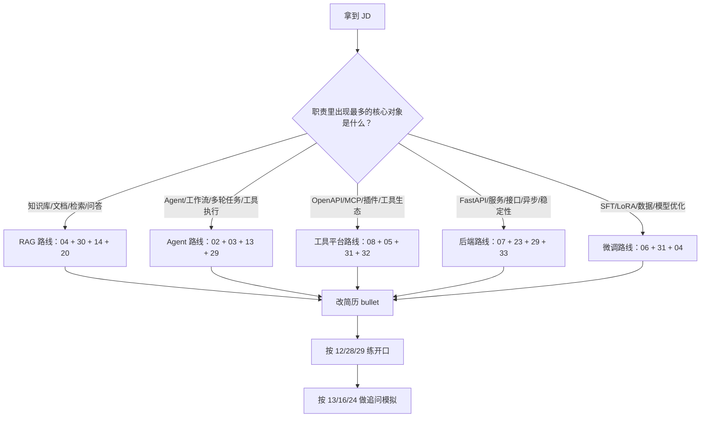

# JD 关键词匹配与投递策略

> 目标：看到一个 AI Agent / RAG / 大模型应用开发 JD 后，快速判断岗位类型、面试重点、简历改法和复习路线。  
> 这份不是八股堆料，而是把“岗位语言”翻译成“面试准备动作”。

## 1. 先给 JD 做三层拆解

拿到 JD 后，不要先问“我会不会 LangChain”。先按下面三层拆：

```text
岗位方向
  -> 大模型应用 / RAG / Agent / 平台工具 / 算法微调 / Python 后端

核心交付
  -> 做 Demo / 做业务系统 / 做平台能力 / 做模型优化 / 做工程稳定性

面试信号
  -> 会问原理 / 会问项目 / 会问系统设计 / 会问手撕 / 会问业务落地
```

一个 JD 通常不会只对应一个方向。比如“负责企业知识库 Agent，支持工具调用、流程编排、权限控制、效果评估”，它同时包含：

- RAG：知识库、检索、召回、重排、引用。
- Agent：任务规划、工具调用、状态管理。
- 平台：权限、审计、评估、成本。
- 后端：接口、异步、流式响应、稳定性。

面试准备要按权重排，不要平均用力。

## 2. JD 关键词到复习模块映射

| JD 关键词 | 岗位含义 | 高频追问 | 优先阅读 |
|---|---|---|---|
| RAG、知识库、检索增强、问答系统 | 以业务知识问答为主 | chunk 怎么切、召回差怎么办、幻觉怎么评估、向量库怎么选 | `04`、`28`、`30`、`14` |
| 向量数据库、Milvus、Faiss、pgvector、Elasticsearch | 检索工程和数据索引能力 | HNSW/IVF 原理、过滤条件、冷热数据、增量更新 | `04`、`30`、`32` |
| LangChain、LCEL、Chain、Retriever、Tool | 应用编排框架能力 | LangChain 组件、优缺点、生产怎么绕坑 | `03`、`28`、`29` |
| LangGraph、StateGraph、多 Agent、工作流 | 有状态 Agent 或流程编排 | checkpoint、interrupt、状态恢复、环路控制 | `03`、`29`、`30`、`14` |
| Agent、规划、任务拆解、自动执行 | Agent 应用开发 | ReAct、Plan-and-Execute、失败重试、工具选择 | `02`、`03`、`13`、`30` |
| Function Calling、Tool Calling、工具调用 | 模型调用外部能力 | schema 设计、参数校验、权限、幂等、工具失败 | `05`、`08`、`28`、`31` |
| MCP、插件、OpenAPI、工具平台 | 工具协议和平台化集成 | MCP 与 OpenAPI 区别、资源/工具/提示词、安全边界 | `08`、`31`、`32` |
| FastAPI、SSE、WebSocket、异步任务 | Python 后端落地 | asyncio、流式输出、超时取消、并发限流 | `07`、`23`、`29`、`33` |
| 模型网关、多模型路由、成本优化 | 平台工程或中台 | 路由策略、限流、降级、审计、缓存、灰度 | `32`、`33`、`09` |
| Prompt Engineering、提示词平台 | Prompt 治理和效果优化 | prompt 注入、结构化输出、版本管理、评测 | `05`、`31`、`32` |
| SFT、LoRA、PEFT、微调、数据构造 | 算法/模型优化方向 | 什么时候微调、数据质量、过拟合、RAG 对比 | `06`、`31` |
| reranker、embedding、召回排序 | RAG 算法增强 | embedding 模型选型、rerank 成本、离线评测 | `04`、`30` |
| 评测、benchmark、A/B、线上效果 | 生产效果治理 | 指标体系、人工评测、golden set、回归测试 | `02`、`04`、`32` |
| 安全、权限、审计、数据隔离 | 企业级落地 | prompt 注入、越权访问、多租户隔离、日志脱敏 | `02`、`05`、`08`、`32` |

阅读编号说明：`04` 表示 `04-RAG与向量数据库.md`，其他同理。

## 3. 判断岗位类型

### 3.1 RAG 应用开发岗

典型 JD：

```text
负责企业知识库、智能问答、文档解析、向量检索、知识召回、答案生成和引用溯源。
```

面试重点：

- RAG 全链路：解析、切分、embedding、索引、召回、rerank、生成、引用。
- 效果优化：召回率、准确率、幻觉率、无答案识别。
- 工程落地：增量更新、权限过滤、多租户、缓存、评测集。

简历要突出：

- 不是“接入了向量数据库”，而是“解决了什么检索问题”。
- 写清楚 chunk 策略、召回策略、rerank、引用、评估指标。
- 最好有数字：命中率、响应耗时、人工满意度、成本下降。

建议准备：

1. `04-RAG与向量数据库.md`
2. `30-P1标准回答-RAG与Agent进阶版.md`
3. `14-系统设计图与伪代码.md`
4. `20-简历项目Bullet优化版.md`

### 3.2 AI Agent 工程岗

典型 JD：

```text
负责 Agent 应用开发，基于 LangGraph/LangChain 实现任务规划、工具调用、多轮对话、工作流编排。
```

面试重点：

- Agent 循环：观察、思考、行动、反馈、终止。
- 工具调用：schema、参数校验、权限、失败恢复、幂等。
- 状态管理：短期记忆、长期记忆、checkpoint、人工介入。
- 生产治理：环路、成本、超时、可观测、评估。

简历要突出：

- 你不是只“用了 Agent”，而是设计了状态、工具和失败处理。
- 写清楚复杂任务如何拆解，什么时候让模型决策，什么时候用确定性代码。
- 强调线上风险治理：最大步数、工具白名单、人工确认、日志追踪。

建议准备：

1. `02-Agent基础与生产治理.md`
2. `03-LangChain与LangGraph.md`
3. `13-大厂连续追问链.md`
4. `29-P0标准回答-LangGraph后端版.md`

### 3.3 工具平台 / MCP / 插件岗

典型 JD：

```text
负责大模型工具生态建设，支持 OpenAPI 接入、MCP Server、插件市场、工具权限和调用审计。
```

面试重点：

- OpenAPI 如何转 Tool schema。
- MCP 的资源、工具、提示词、客户端、服务端边界。
- 工具平台的鉴权、限流、审计、版本兼容。
- 工具失败、参数错误、外部 API 慢调用怎么处理。

简历要突出：

- 写成“工具接入平台”，不要写成“调用了几个 API”。
- 强调 schema 标准化、权限隔离、调用追踪、错误恢复。
- 最好准备一个“OpenAPI 转工具”的设计题。

建议准备：

1. `08-协议与工具集成-OpenAPI-RPC-MCP.md`
2. `05-Prompt与ToolCalling.md`
3. `31-P1标准回答-Prompt协议微调版.md`
4. `32-P2系统设计平台加分版.md`

### 3.4 Python 大模型后端岗

典型 JD：

```text
负责大模型应用后端开发，使用 Python/FastAPI，支持流式响应、异步任务、缓存、限流和服务稳定性。
```

面试重点：

- FastAPI 请求生命周期、依赖注入、中间件。
- SSE/WebSocket 流式输出。
- asyncio、任务取消、超时控制。
- 限流、缓存、重试、熔断、日志、监控。

简历要突出：

- 不要只写“用 FastAPI 搭建接口”，要写并发、流式、稳定性。
- 写清楚模型调用超时、用户断连、任务取消、结果缓存怎么处理。
- 代码题常见是 LRU、限流器、并发抓取、SSE 生成器。

建议准备：

1. `07-Python后端工程.md`
2. `23-手撕题强化版.md`
3. `29-P0标准回答-LangGraph后端版.md`
4. `33-P2代码表达加分版.md`

### 3.5 算法微调 / 模型优化岗

典型 JD：

```text
负责大模型 SFT、LoRA、数据构造、评测优化，结合业务场景提升模型指令遵循和领域问答效果。
```

面试重点：

- 什么时候用 RAG，什么时候用微调。
- SFT/LoRA/PEFT 的区别和适用场景。
- 数据清洗、指令构造、训练评估、过拟合控制。
- embedding/reranker 与生成模型微调的边界。

简历要突出：

- 写数据规模、清洗策略、评估指标，而不是只写“微调了模型”。
- 强调业务指标提升和失败样本分析。
- 准备好回答“为什么不直接 RAG”。

建议准备：

1. `06-模型微调.md`
2. `31-P1标准回答-Prompt协议微调版.md`
3. `04-RAG与向量数据库.md`
4. `25-English-Interview-Answers.md`

## 4. JD 优先级评分法

用下面方法给岗位打分，避免盲投和盲背。

### 4.1 关键词频次

| 出现情况 | 判断 |
|---|---|
| 同一类关键词出现 1 次 | 可能只是加分项 |
| 同一类关键词出现 2-3 次 | 大概率是一面重点 |
| 同一类关键词出现在岗位职责和任职要求里 | 优先准备项目和原理 |
| 关键词出现在“负责搭建/优化/落地/上线”后面 | 大概率会问系统设计和项目深挖 |

### 4.2 动词比名词更重要

JD 里的动词决定面试深度。

| JD 动词 | 面试含义 | 准备方式 |
|---|---|---|
| 了解、熟悉 | 会问概念和优缺点 | 背 30 秒版 |
| 使用、接入 | 会问 API 和踩坑 | 准备项目细节 |
| 负责、设计 | 会问架构和取舍 | 准备系统设计 |
| 优化、提升 | 会问指标和实验 | 准备数据和对比 |
| 上线、运维 | 会问稳定性和治理 | 准备超时、限流、监控 |
| 建设、平台化 | 会问多租户、权限、版本、成本 | 准备 P2 平台题 |

### 4.3 必备项和加分项分开看

常见误判：

- JD 写“熟悉 LangChain 加分”，不要把全部时间压在 LangChain。
- JD 写“具备 Python 后端经验，熟悉 RAG”，后端工程可能和 RAG 一样重要。
- JD 写“有模型训练经验优先”，但职责全是应用开发，则微调通常是加分项。
- JD 写“负责 Agent 平台建设”，那就不能只背 ReAct，要准备平台设计。

## 5. 投递前 15 分钟 JD 分析模板

复制下面模板即可：

```markdown
# JD 分析

## 岗位名称

## 关键词摘录
- RAG：
- Agent：
- Tool/MCP：
- Python 后端：
- 微调/算法：
- 平台治理：

## 岗位主方向
- [ ] RAG 应用
- [ ] Agent 工程
- [ ] 工具/MCP 平台
- [ ] Python 后端
- [ ] 算法微调
- [ ] 综合平台岗

## 面试 P0
1.
2.
3.

## 简历需要强化的 bullet
1.
2.
3.

## 今日复习文件
1.
2.
3.

## 需要准备的项目追问
1.
2.
3.
```

## 6. 按 JD 类型改简历

### 6.1 RAG JD 的简历写法

弱表达：

```text
使用 LangChain 和向量数据库实现知识库问答。
```

强表达：

```text
负责企业知识库 RAG 问答链路，完成文档解析、语义切分、向量召回、rerank、引用溯源和无答案识别；通过多路召回与重排优化，将核心问题命中率从 X% 提升到 Y%，平均响应耗时控制在 Z 秒内。
```

面试官会追问：

- chunk 大小怎么定？
- 多路召回怎么融合？
- rerank 放在哪里？
- 如何证明效果提升？
- 权限过滤在召回前还是召回后？

### 6.2 Agent JD 的简历写法

弱表达：

```text
基于 LangGraph 实现 Agent 工作流。
```

强表达：

```text
基于 LangGraph 设计多步骤任务 Agent，将用户意图识别、工具选择、参数补全、执行确认、结果总结拆成显式状态节点；引入 checkpoint、最大步数、工具白名单和失败重试机制，降低工具误调用和循环调用风险。
```

面试官会追问：

- 为什么用 LangGraph 而不是普通 chain？
- state 里放什么？
- checkpoint 有什么价值？
- 工具失败怎么恢复？
- 如何避免 Agent 一直循环？

### 6.3 MCP / 工具平台 JD 的简历写法

弱表达：

```text
接入 MCP 工具，实现外部 API 调用。
```

强表达：

```text
设计大模型工具接入层，支持 OpenAPI 工具描述解析、MCP Server 接入、统一鉴权、参数校验、调用审计和错误标准化；为 Agent 提供可控、可追踪、可扩展的工具调用能力。
```

面试官会追问：

- OpenAPI 和 MCP 的边界是什么？
- 工具 schema 怎么设计？
- 工具权限怎么控制？
- 外部 API 超时怎么处理？
- 如何做工具版本兼容？

### 6.4 Python 后端 JD 的简历写法

弱表达：

```text
使用 FastAPI 开发大模型服务接口。
```

强表达：

```text
基于 FastAPI 构建大模型应用后端，支持 SSE 流式响应、异步模型调用、请求级超时、用户断连取消、限流、缓存和结构化日志；提升接口稳定性并降低重复调用成本。
```

面试官会追问：

- SSE 和 WebSocket 怎么选？
- 用户断开连接后模型调用怎么取消？
- asyncio 里 CPU 密集任务怎么办？
- 限流怎么实现？
- 模型接口慢或失败怎么办？

### 6.5 微调 JD 的简历写法

弱表达：

```text
使用 LoRA 微调大模型。
```

强表达：

```text
围绕业务指令遵循和领域回答质量构建 SFT 数据集，完成数据清洗、指令模板设计、LoRA 微调、离线评测和失败样本分析；对比 RAG、Prompt 优化和微调方案，选择适合业务成本与效果的模型优化路径。
```

面试官会追问：

- 为什么需要微调？
- 数据怎么构造？
- 如何避免灾难性遗忘？
- 指标怎么设计？
- 什么时候不建议微调？

## 7. 公司侧 JD 信号判断

> 以下是根据公开招聘描述、公开面经和大厂业务风格总结的准备方向。单个 JD 会有差异，最终以具体岗位描述为准。

| 公司/类型 | JD 常见信号 | 更可能深挖 | 准备重点 |
|---|---|---|---|
| 腾讯 | 业务场景、用户体验、工程落地、稳定性 | 项目细节、效果指标、业务取舍 | RAG 效果、Agent 风险、Python 后端 |
| 阿里 | 平台化、工程体系、业务中台、性能稳定 | 架构设计、抽象能力、治理体系 | 模型网关、工具平台、多租户、评测 |
| 百度 | 搜索、知识增强、模型能力、文心生态 | RAG 原理、检索排序、模型评估 | 向量检索、rerank、微调边界 |
| 字节 | 效率、实验、增长、快速迭代 | 指标、A/B、代码能力、系统设计 | 评测体系、Agent 迭代、手撕题 |
| 美团/滴滴/快手等业务平台 | 真实业务流程、客服、运营、数据分析 | 业务闭环、工具调用、稳定性 | Agent + Tool + 后端治理 |
| 创业公司 | 全栈落地、快速交付、多模型接入 | 端到端能力、成本、上线经验 | RAG/Agent 全链路和 Demo 到生产 |

## 8. JD 红旗和避坑

### 8.1 可能偏“套壳 Demo”的 JD

信号：

- 只写“熟悉 ChatGPT、Prompt、LangChain”，没有业务系统、数据、上线、评估。
- 不提权限、稳定性、成本、评估，只强调“快速实现 AI 功能”。
- 要求非常宽：前端、后端、算法、训练、部署、销售支持全都要。

应对：

- 面试时主动问业务闭环、数据来源、效果指标和上线标准。
- 简历里不要把自己定位成只会调 API，要强调工程化能力。
- 如果岗位没有成长空间，谨慎投入太多准备时间。

### 8.2 可能偏“纯算法”的 JD

信号：

- 高频出现 SFT、RLHF、DPO、预训练、分布式训练。
- 很少提业务系统、Agent、工具调用、后端服务。
- 要求论文、竞赛、模型训练经验。

应对：

- 如果你主攻应用开发，不要硬投纯算法岗。
- 可以投“模型应用算法”或“RAG 算法工程”这种交叉岗。
- 准备 RAG、embedding、reranker、数据构造，少讲前端和业务 CRUD。

### 8.3 可能偏“后端平台”的 JD

信号：

- 高频出现网关、平台、服务治理、稳定性、监控、权限、多租户。
- 大模型关键词只是业务背景。

应对：

- Python/后端基础要补足。
- 项目表达要从“模型效果”转为“平台可靠性和扩展性”。
- 准备限流、缓存、异步、任务队列、日志审计、灰度发布。

## 9. JD 到复习路径的决策树



## 10. 面试前按 JD 反推问题

### JD 写“优化 RAG 效果”

必准备：

- 你优化的指标是什么？
- 召回差怎么定位？
- 什么时候加 rerank？
- 怎么构造评测集？
- 线上坏 case 怎么回流？

推荐回答结构：

```text
先讲现象：用户问什么问题答不好。
再讲定位：是解析、切分、召回、排序、生成哪个环节。
再讲方案：多路召回、metadata 过滤、rerank、prompt 约束、引用校验。
最后讲指标：命中率、准确率、幻觉率、耗时、人工满意度。
```

### JD 写“Agent 自动执行任务”

必准备：

- Agent 什么时候该自动执行，什么时候要人工确认？
- 如何避免误调用工具？
- 如何处理工具失败？
- 如何记录执行过程？
- 如何限制成本和最大步数？

推荐回答结构：

```text
先把任务拆成状态图。
再说明模型负责意图和决策，代码负责校验和执行。
然后讲工具白名单、参数校验、人工确认、最大步数、超时重试。
最后讲日志、trace、评测和回放。
```

### JD 写“建设工具平台/MCP”

必准备：

- 工具描述如何标准化？
- OpenAPI 如何转 tool schema？
- MCP Server 怎么暴露能力？
- 工具权限如何隔离？
- 如何做审计和版本兼容？

推荐回答结构：

```text
先讲接入层：OpenAPI/MCP/内部 RPC。
再讲规范层：schema、鉴权、参数校验、错误码。
再讲执行层：限流、超时、重试、幂等。
最后讲治理层：审计、trace、版本、灰度、成本。
```

## 11. 投递优先级建议

### 高优先级岗位

适合重点投：

- JD 职责和你的项目高度重合。
- 有明确业务场景，不只是“探索 AI”。
- 有 RAG/Agent/Tool/后端中的 2-3 个方向交集。
- 要求能上线、优化、评估，而不是只做 Demo。
- 你的简历能改出 3 条强相关 bullet。

### 中优先级岗位

可以投，但准备要聚焦：

- JD 有一个核心方向匹配，另一个方向偏弱。
- 比如你强 RAG，但 JD 也要求微调。
- 比如你强后端，但 JD 也要求 LangGraph。
- 这种岗位不要补全所有短板，只补会被一面问到的 P0。

### 低优先级岗位

谨慎投：

- JD 关键词过于泛化，没有明确交付。
- 岗位要求横跨前端、后端、算法、训练、运维、产品。
- 核心要求是预训练、强化学习、分布式训练，而你主攻应用开发。
- 简历无法改出强相关项目，只能写“了解”。

## 12. 一页纸投递检查清单

投递前确认：

- [ ] 我能用一句话说出这个 JD 是 RAG、Agent、工具平台、后端还是微调。
- [ ] 我能标出 JD 里 5 个最重要关键词。
- [ ] 我能为这个 JD 改出 3 条强相关简历 bullet。
- [ ] 我能准备 1 个最匹配项目的 2 分钟讲稿。
- [ ] 我能回答这个岗位最可能问的 10 个 P0 问题。
- [ ] 我知道哪些要求只是加分项，不会被它们带偏。
- [ ] 我准备了 2 个反问：业务场景、效果指标、上线标准、团队分工。

## 13. 与其他文件的关系

这份文件是投递入口，推荐这样使用：

```text
37 分析 JD
  -> 20 改简历 bullet
  -> 18 准备自我介绍
  -> 12/28/29 练 P0 开口
  -> 13/16 做连续追问和模拟面
  -> 14/24 准备系统设计和项目答辩
  -> 34 临面冲刺
  -> 35 面后复盘
```

一句话总结：

```text
JD 决定复习优先级，简历决定面试入口，项目决定追问深度，八股决定你能不能稳住一面。
```
